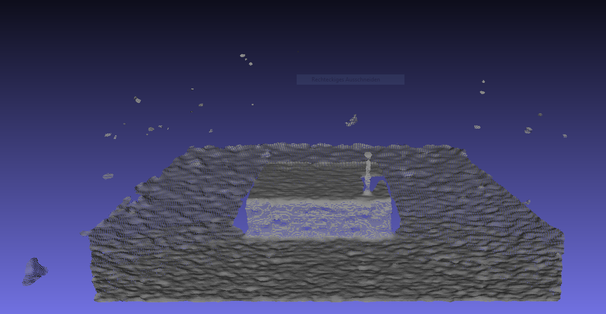
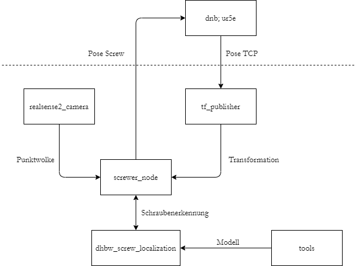
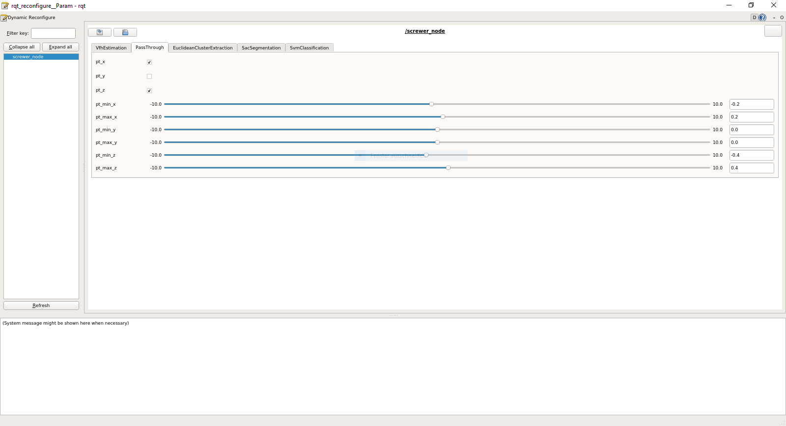

# ScrewRobotStudien
Dieses Repository enthält in der aktuellen Fassung (Mai 2020) die wesentlichen Bestandteile der Bildverarbeitung, um Schrauben inklusive deren Ausrichtung in Punktwolken zu erkennen. Dabei handelt es sich um einen Ansatz, der durchaus Alternativen besitzt. Das zugrundeliegende Szenario sieht einen kollaborativen Roboter vor, der eine von Menschen eingesteckte Schraube selbständig erkennt und vollständig einschraubt.

Grundsätzlich fehlt in diesem Zusammenhang also die Steuerung des Roboters. Ein kurzer Überblick des aktuellen Standes kann auch [hier](https://github.com/MobMonRob/ScrewRobotStudien/blob/master/documentation/Stand_Mai_2020.pdf) eingesehen werden.

#### Vorgesehene Technologie:

- Robot Operating System (ROS)
- PointCloudLibrary (PCL)
- Intel RealSense D435
- Universal Robots - UR5e
- Drag&Bot (DnB)

***

## Komponenten

### realsense2_camera
ROS-Node, welche die Interaktion mit der Tiefenkamera wrappt und diese damit in ROS integriert. Die Punktwolke wird per Topic auf `/camera/depth/color/points` publiziert.

### tf_publisher
ROS-Node, welche die tf-frames zwischen `tcp`, `camera` und `ur_base` bereitstellt. Sie nimmt die tcp-pose auf dem Topic `/screwer_pose` entgegen. Zum Training (ohne Roboter) können im [Quellcode](https://github.com/MobMonRob/ScrewRobotStudien/blob/a1514746ea81185f4cafece0692d75be886c5a28/ros/src/tf_publisher/src/tf_publisher_node.cpp#L20-L39) statische Abhängigkeiten zwischen den Koordinatensystemen angegeben werden.

### dhbw_screw_localization
ROS-Library, welche die bildverarbeitenden Operationen, sowie die Klassifikation mittels SVM enthält. [Parameter](https://github.com/MobMonRob/ScrewRobotStudien/blob/72fb01d209d6d304ddb5e8205c9e3318ea23e3c3/ros/src/dhbw_screw_localization/include/dhbw_screw_localization/PclEyeParameters.h#L57-L64) der einzelnen Verfahren können übergeben werden.

### screwer_node
ROS-Node, welche die Ablaufsteuerung der Anwendung übernimmt. Die Punktwolke wird entgegengenommen, transformiert und der Schraubenerkennung (dhbw_screw_localization) übergeben.

## Verwendung (Ubuntu)

#### Repository klonen
    git clone https://github.com/MobMonRob/ScrewRobotStudien.git
    cd ScrewRobotStudien

#### ROS installieren

    sudo sh -c 'echo "deb http://packages.ros.org/ros/ubuntu `lsb_release -sc` main" > /etc/apt/sources.list.d/ros-latest.list'
    
    wget http://packages.ros.org/ros.key -O - | sudo apt-key add -

    sudo apt update
    sudo apt install ros-melodic-desktop-full
    source /opt/ros/melodic/setup.bash

    sudo apt install python-rosdep
    sudo rosdep init
    rosdep update

#### Catkin installieren
    
    sudo apt install python-pip
    sudo pip install -U catkin_tools

#### Build

    cd ros
    catkin build
    source devel/setup.bash

    
### Dynamische Konfiguration
Die wesentlichen Parameter der Anwendung können dynamisch während der Laufzeit konfiguriert werden. Bei Verwendung der bestehenden Launch-Files öffnet sich automatisch ein Fenster. Für die Beispiel-Daten muss einmal die `default.yaml`-Konfiguration aus `screwer_node/cfg` geladen werden, damit diese aktiv sind.

    rosrun rqt_reconfigure rqt_reconfigure

### Training
Punktwolken werden ausschließlich geclustert und nicht klassifiziert. Dieser Modus kann genutzt werden, um Trainingsdaten (Cluster) aus den Punktwolken zu generieren.  Diese können anschließend durch die tools [ply-classifier](https://github.com/MobMonRob/ScrewRobotStudien/tree/master/tools/ply-classifier) und [svm-trainer](https://github.com/MobMonRob/ScrewRobotStudien/tree/master/tools/svm-trainer) zu einem SVM-Modell weiterverarbeitet werden.

Dafür werden die Hilfs-Nodes `ply_reader` und `ply_writer` verwendet, welche die Ein- und Ausgabe aus bzw. in `*.ply`-Dateien ermöglichen.

        roslaunch ros/launch/training.launch

Wichtig ist weiterhin, dass die Klassifizierung in der SVM mithilfe der dynamischen Konfiguration deaktiviert wird. Dateipfade können bzw. müssen im Launch-File angepasst werden.

### "Produktiv"
Punktwolken werden durch die trainierte SVM klassifiziert, um "falsche" Cluster zu filtern. Es werden die Punktwolken der Kamera verwendet. Die verwendete Konfiguration der RealSense D435 ist in `ros/launch/config/` zu finden. Die Ausgabe erfolgt auf das Topic `/screw_pcloud`. Neben der Punktwolke enthält das Ergebnis der Schraubenerkennung auch eine orientierte Bounding-Box, welche unter anderem die Ausrichtung der Schraube beschreibt.

Die Klassifizierung mittels SVM muss in der dynamischen Konfiguration aktiviert und entsprechend auf das zu verwendende Modell konfiguriert sein.

        roslaunch ros/launch/productive.launch
